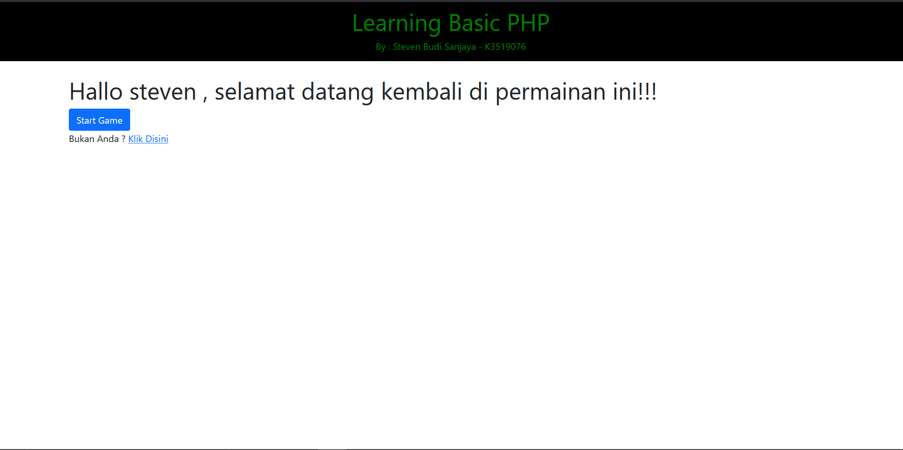
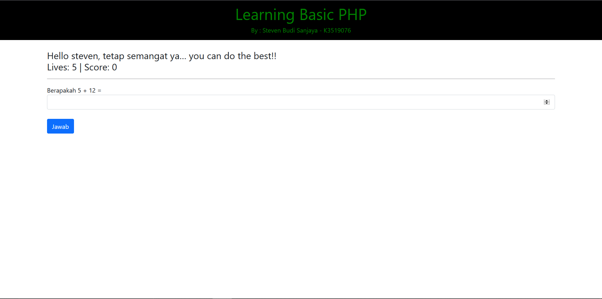
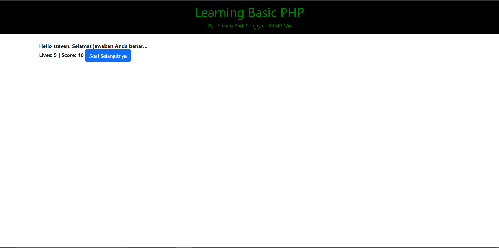
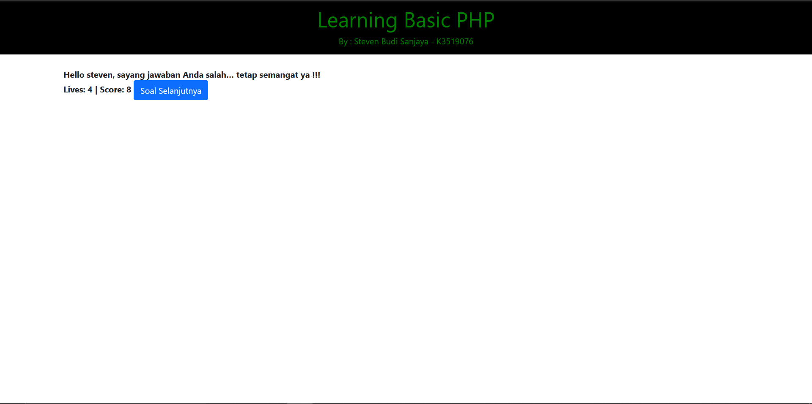
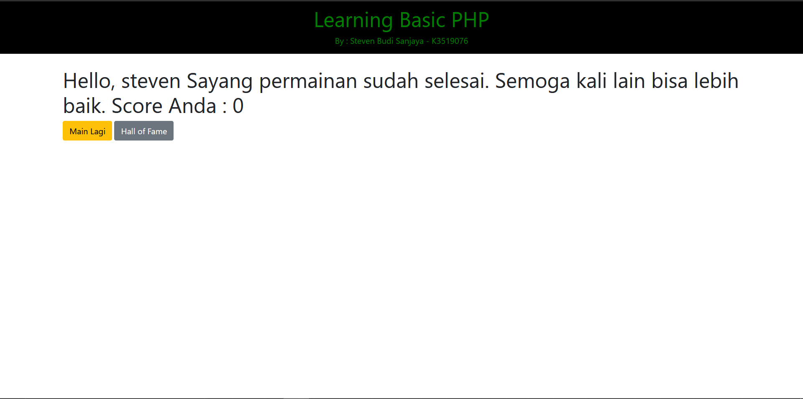
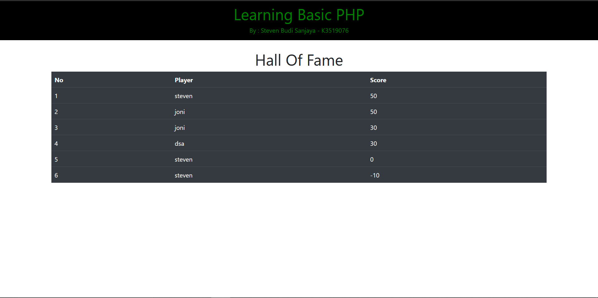

# **Project UTS K3519076**
## [Website](http://crosner.infinityfreeapp.com/) Quiz / Permainan Pertambahan Sederhana

 
Website ini akan memberikan pertanyaan kepada pemain mengenai penjumlahan. Sebelum bermain, pemain akan diberikan 5 nyawa. Ketika permain berhasil menjawab pertanyaan dengan benar maka skor pemain akan bertambah 10. Tetapi ketika pemain gagal menjawab pertanyaan dengan benar maka skor akan berkurang 2 dan nyawa pemain akan berkurang 1. Permainan berakhir ketika nyawa pemain 0.

 

# **Tampilan Website**
### Awal Website Ketika Pemain Belum Login

### Awal Website Ketika Pemain Sudah Login

### Permainan/Quiz

### Ketika Jawaban Pemain Benar

### Ketika Jawaban Pemain Salah

### Ketika Permainan Berakhir

### Hall of Fame

 

## Link Website : http://crosner.infinityfreeapp.com/.

*Terkandang ketika website diklik url akan berubah menjadi http://crosner.infinityfreeapp.com/i=1? silahkan hapus i=1? dan refresh halaman.*

# Table of Contents Guide
|Filename|Summary|
|--------|-------|
|[img](img)|Website's Images|
|[login.php](login.php)|Login form for player or Welcome page if player already logged in|
|[proses.php](proses.php)|Proccess Cookies and Sessions for player|
|[header.php](header.php)|Website's header for every page|
|[reset.php](reset.php)|Reset player's cookies|
|[dashboard.php](dashboard.php)|Game/Quiz Page|
|[dbconfig.php](dbconfig.php)|Database connection|
|[connection.php](connection.php)|Function for fetching data from database|
|[rangking.php](ranking.php)|Hall of Fame|